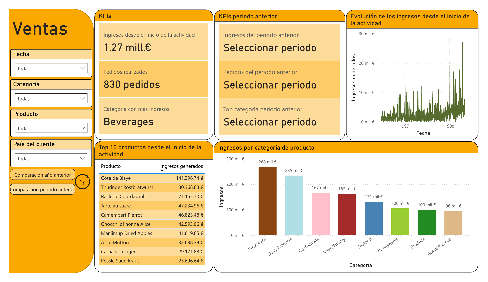
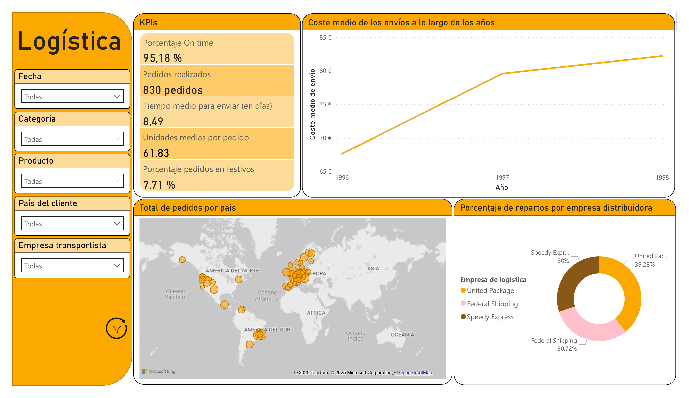
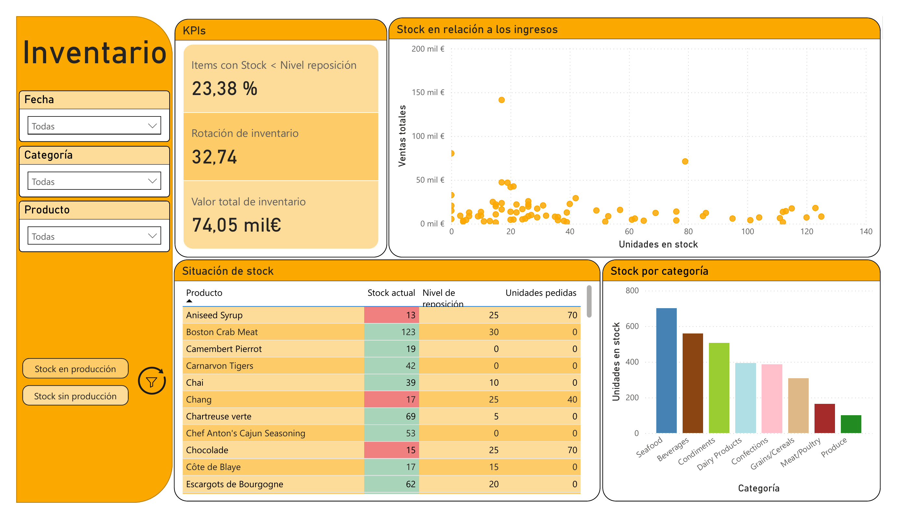
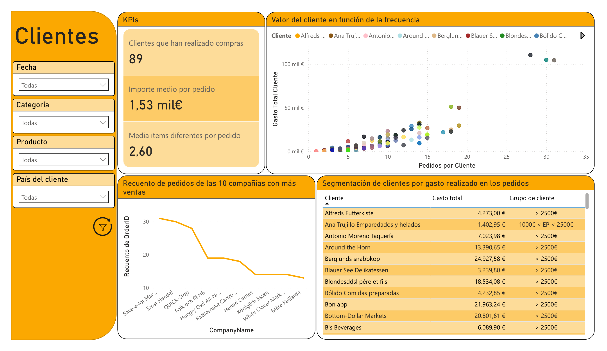

# 📊 Power BI – Informe basado en Northwind (Proyecto personal)

Este informe fue desarrollado como proyecto individual durante una formación interna sobre Power BI, utilizando la base de datos pública **Northwind**, comúnmente usada para aprendizaje y pruebas.

## 🧠 Objetivo del proyecto

- Construir un modelo relacional completo a partir de Northwind.
- Desarrollar medidas DAX complejas para análisis por ventas, inventario, logística y segmentación de clientes.
- Aplicar principios de diseño visual, limpieza de datos y storytelling empresarial.

## ⚙️ Estructura del informe

El informe está dividido en 4 secciones principales:
1. **Ventas** – KPIs, ventas acumuladas, comparación por región y producto.
2. **Logística** – Tiempos de entrega, transportistas, análisis por país.
3. **Inventario** – Stock, productos por categoría, niveles de unidades.
4. **Clientes** – Segmentación, análisis top 10 por ventas, tipo de relación.

Se incluyen más de **500 líneas de código DAX** distribuidas en múltiples tablas de medidas, optimizadas para reusabilidad y claridad.

## 🖼️ Vistas del informe

| Ventas | Logística |
|--------|-----------|
|  |  |

| Inventario | Clientes |
|------------|----------|
|  |  |

## 🤝 Colaboración

La mayoría de las medidas, estructura del modelo de datos y diseño visual fueron desarrollados individualmente.  
La sección **Clientes** incluye dos visualizaciones diseñadas en colaboración con una compañera durante una sesión de práctica conjunta.

## 🔐 Notas sobre privacidad

Este repositorio es privado y se utiliza como parte de un portafolio técnico.  
No contiene datos reales ni material confidencial de empresa.  
Todos los datos provienen de la base pública **Northwind**.

## 📁 Archivos incluidos

- `Informe Northwind.pbix` – Informe completo en Power BI
- `README.md` – Documentación técnica
- `capturas/` – Imágenes por pestaña del informe (opcional)
